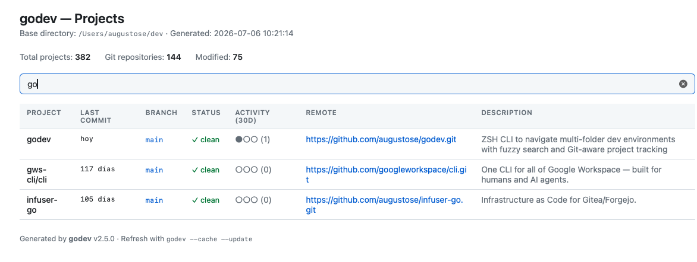
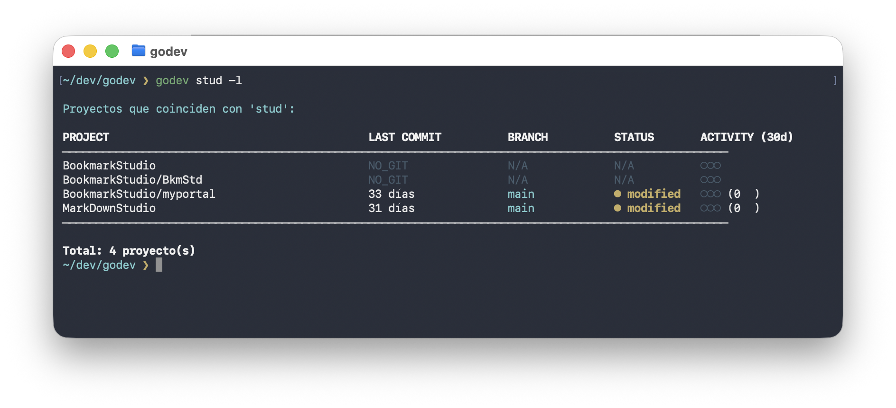

<div align="center">

# 🚀 godev

### Navigate 100+ projects in seconds. Demystify your development tree.

[](https://github.com/augustose/godev/releases)
[](LICENSE)
[](https://www.zsh.org/)
[](#)

**Lightning-fast project navigation** • **Git-aware** • **Zero configuration** • **FZF-powered**

[Quick Start](#-quick-start) • [Features](#-features) • [Installation](#-installation) • [Usage](#-usage) • [Documentation](#-documentation)

</div>

---

## 🎯 The Problem

Managing dozens or hundreds of development projects is chaos:

```zsh
# The old way 😫
cd ~/dev
ls
cd some-project... wait, which one?
cd ../
ls | grep "web"
cd webapp... or was it web-app?
# ... 5 minutes later ...
pwd
```

**There has to be a better way.**

## ✨ The Solution

```zsh
# The godev way 🚀
godev web
```

**Instant results** with beautiful, interactive selection:

<div align="left">

```zsh
┌─────────────────────────────────────────────────────────
 1) webapp                [main - ✓]         ●●● (45 commits)
 2) web-api               [develop - ●]      ●●○ (12 commits)
 3) website-redesign      [feature/new - ✓]  ●○○ (3 commits)
 4) webserver-old         [no git]           ○○○
└─────────────────────────────────────────────────────────

Selecciona: 1
✓ You're in webapp
```

</div>

**One command. Zero friction. Maximum productivity.**

---

## ⚡ Quick Start

### Homebrew (recommended)

```zsh
brew install augustose/godev/godev
godev --init --install && source ~/.zshrc
```

### One-line installation

```zsh
curl -fsSL https://raw.githubusercontent.com/augustose/godev/main/installer.sh | zsh
```

That's it! Start using immediately:

```zsh
godev                # Interactive fuzzy finder
godev myproject      # Jump to project instantly
godev --list         # See all projects with Git info
```

---

## 🎨 Features

<table>
<tr>
<td width="50%">

### 🔍 **Smart Search**
- Fuzzy project matching
- Case-insensitive search
- Multi-match interactive selection
- Powered by [**FZF**](https://github.com/junegunn/fzf)

### 📊 **Git Intelligence**
- Branch and status at a glance
- Commit activity tracking (30 days)
- Modified files detection
- Works with non-Git projects too

</td>
<td width="50%">

### ⚡ **Lightning Fast**
- Navigate in milliseconds
- Efficient project scanning
- Handles 500+ projects easily
- Minimal resource usage

### 🎯 **Zero Config**
- Works out of the box
- Auto-detects project structure
- One-line installation
- Intelligent defaults

</td>
</tr>
</table>

### 🌟 Powered by FZF

godev integrates seamlessly with [**junegunn/fzf**](https://github.com/junegunn/fzf), the legendary command-line fuzzy finder with **60k+ stars**. FZF provides:

- ⚡ Blazing-fast interactive filtering
- 🎨 Beautiful, customizable UI
- 📋 Live preview with Git info
- ⌨️ Intuitive keyboard navigation

> **Note:** godev works without FZF, but the experience is *premium* with it. We highly recommend installing FZF for the best experience.

---

## 📦 Installation

### Homebrew (recommended)

```zsh
brew install augustose/godev/godev
```

Then wire up the shell integration — one command, once:

```zsh
godev --init --install && source ~/.zshrc
```

### Why the extra step?

godev changes your shell's current directory, and **a child process cannot change
its parent's working directory** — that is how processes work, not a limitation of
godev. So it needs a small function defined *in* your shell.

Homebrew never edits your `~/.zshrc`, by policy. `godev --init --install` does it for
you instead: it backs up your `~/.zshrc`, adds one line, validates the result with
`zsh -n` before replacing anything, and tells you exactly what it changed. It asks for
confirmation first, and cancelling leaves the file byte-for-byte untouched.

If you would rather do it by hand, add this line to your `~/.zshrc`:

```zsh
eval "$(command godev --init zsh)"
```

Every tool in this category — `zoxide`, `direnv`, `starship`, `fzf` — works the same way.

### Automatic script install

```zsh
curl -fsSL https://raw.githubusercontent.com/augustose/godev/main/installer.sh | zsh
```

**What it does:**
- ✅ Installs godev to `~/.local/bin`
- ✅ Configures the ZSH shell integration
- ✅ Detects and integrates with FZF
- ✅ Sets up your projects directory
- ✅ Creates backups automatically

### Manual Installation

<details>
<summary>Click to expand manual installation steps</summary>

1. Download the script
```zsh
mkdir -p ~/.local/bin
curl -fsSL https://raw.githubusercontent.com/augustose/godev/main/godev -o ~/.local/bin/godev
chmod +x ~/.local/bin/godev
```

2. Add the shell integration to ~/.zshrc
```zsh
~/.local/bin/godev --init --install
```

Or add the line yourself:
```zsh
echo 'eval "$(command godev --init zsh)"' >> ~/.zshrc
```

3. Reload and configure
```zsh
source ~/.zshrc
godev --setup
```

</details>

### Already installed via the script? Migrating to Homebrew

**Your configuration is preserved automatically.** `~/.config/godev/` follows the XDG
spec and the Homebrew build reads the exact same path, so your base directory, cached
dashboard and version info all survive. There is nothing to export.

What does need replacing is the old wrapper: it calls `~/.local/bin/godev` by absolute
path, so it would keep running the old copy and ignore Homebrew entirely.

```zsh
# 1. Install via Homebrew
brew install augustose/godev/godev

# 2. Replace the old wrapper. Call the Homebrew binary by its full path --
#    see the note below for why. This backs up your ~/.zshrc, removes the old
#    godev() function, and warns you about leftover copies on your PATH.
"$(brew --prefix)/bin/godev" --init --install

# 3. Remove the old binary (your config in ~/.config/godev is NOT touched)
rm ~/.local/bin/godev

# 4. Open a NEW terminal, then verify
godev --version
```

> **Open a new terminal for step 4 — `source ~/.zshrc` is not enough.** The old
> `godev` function is still defined in your current session, and sourcing does not
> remove it. It would intercept the new integration line before it can replace
> itself. If you would rather stay in the same shell: `unset -f godev && source ~/.zshrc`.

> **Why the full path in step 2?** Your current `godev` is still the old shell
> function, and it calls `~/.local/bin/godev` by absolute path — the pre-2.7.0
> binary, which has no `--init` flag and would treat it as a project name. You
> need to reach the Homebrew binary directly, once. After step 4, plain
> `godev --init` works normally.

A few notes:

- **Do not delete `~/.config/godev/`** — that is where your settings live.
- An `alias gd='godev'` you added yourself keeps working, and `--init --install`
  leaves it alone. It only replaces the wrapper function.
- If the installer had added a `~/.local/bin` line to your `PATH` and nothing else
  uses it, you can drop it — but that is your call, and godev will not do it for you.
- Any `godev.backup-*` files left in `~/.local/bin/` by past `--update` runs are
  yours to keep or remove. godev never deletes them.

Once installed via Homebrew, `godev --update` will not self-update anymore. It tells
you a new version exists and points you at `brew upgrade godev`, which is the right
tool for a Homebrew-managed install.

### Installing FZF (Optional but Recommended)

```zsh
# macOS
brew install fzf

# Ubuntu/Debian
sudo apt install fzf

# Fedora
sudo dnf install fzf
```

---

## 🚀 Usage

### Basic Commands

```zsh
# Navigation
godev                     # Interactive fuzzy finder (with FZF)
godev <project>           # Jump to project
godev <partial-name>      # Fuzzy search with selection

# Listing
godev --list              # List ALL projects with Git stats (alphabetical)
godev -l                  # Short form
godev --list --sort-by-commit  # Sort by last commit (most recent first)
godev --list --remote     # Include remote URL column
godev --list --tree       # Tree view of projects
godev --list --depth N    # Override search depth (default: 3)
godev <pattern> -l        # List projects matching pattern

# HTML Dashboard
godev --cache             # Open HTML dashboard in browser (generates it if missing)
godev --cache --update    # Regenerate the HTML with fresh data, then open it

# Shell integration
godev --init zsh          # Print the shell function
godev --init --install    # Wire it into ~/.zshrc (backup + confirmation)
godev --init --alias gg   # Optionally define a short alias (opt-in)

# Other
godev --update            # Check GitHub for a new version and install it
godev --setup             # Configure or reconfigure
godev --version, -v       # Show version
godev --help, -h          # Show help
```

> **On short aliases:** godev never claims one for you. `gd` in particular is
> `git diff` in oh-my-zsh's git plugin, and taking it would break that *silently*.
> `--init --alias NAME` is opt-in, defaults to off, and warns you before it
> shadows something you already have.

### HTML Dashboard

`godev --cache` renders your full project list (the equivalent of `--list --remote`)
as a static HTML page at `~/.config/godev/projects.html` and opens it in your
browser (`open` on macOS, `xdg-open` on Linux). No external dependencies — plain
HTML/CSS with automatic dark mode and an instant client-side filter.



Columns: project (links to the folder via `file://`), last commit, branch,
status, 30-day activity, remote (normalized to a clickable web URL) and an
optional per-repo description. To set a description for a repo:

```zsh
git config --local repo.description "Short description of the project"
```

The page is a cached snapshot — run `godev --cache --update` to refresh it.

### Updating godev

Keep godev up to date without re-running the installer:

```zsh
godev --update
```

It checks the [latest GitHub release](https://github.com/augustose/godev/releases),
and if a newer version exists it shows `current → new` and asks for confirmation
before installing. The update is **safe by design**:

- Downloads from the release **tag**, so the version announced is exactly the one installed.
- Validates the downloaded script (syntax + sanity check) before touching anything.
- Backs up your current binary next to itself as `godev.backup-<timestamp>` and
  replaces it atomically.
- Only contacts the network when you run `--update` — never during normal navigation.

Nothing else is touched: your `~/.zshrc`, config, and projects stay as they are.
After updating, reload your shell with `source ~/.zshrc`.

**Installed via Homebrew?** `--update` does not self-update — and that is deliberate.
The binary in `$(brew --prefix)/bin` is a symlink into the Cellar; overwriting it would
break Homebrew's bookkeeping, and the next `brew upgrade` would silently discard the
change anyway. Instead, `--update` reports the new version and points you at:

```zsh
brew upgrade godev
```

> **Note:** `--update` is available from **v2.6.0** onward. On older versions,
> re-run the [installer](#-installation) once to get it.

### Real-World Examples

#### Example 1: Quick Navigation

```zsh
$ godev react

Múltiples proyectos encontrados con 'react':

 1) react-dashboard         [main - ✓]         ●●● (45 commits)
 2) react-native-app        [develop - ●]      ●●○ (12 commits)
 3) react-admin-panel       [feature/auth - ✓] ●○○ (3 commits)

Selecciona: 2
✓ You're in react-native-app
```

#### Example 2: List All Projects

```zsh
$ godev -l
# or
$ godev --list

PROJECT                    LAST COMMIT      BRANCH       STATUS       ACTIVITY (30d)
─────────────────────────────────────────────────────────────────────────────────────
godev                     hoy              main         ● modified   ●●● (35)
webapp                    2 días           develop      ✓ clean      ●●○ (12)
api-backend               7 días           main         ✓ clean      ●○○ (4)
mobile-app                21 días          feature/auth ● modified   ○○○ (0)
```

**NEW in v2.2.0:** LAST COMMIT now shows in consistent day format. Sort by activity with `--sort-by-commit`.

#### Example 2b: **NEW** - List Projects by Pattern

Filter projects by name pattern with the `-l` flag:

```zsh
$ godev stud -l
```

<div align="center">

</div>

*Shows projects matching "stud" with Git status, branches, and activity. Notice the **LAST COMMIT** now displays in consistent day format (33 días, 31 días).*

#### Example 3: Interactive Mode with FZF

```zsh
$ godev

# Opens beautiful FZF interface with:
# - Live fuzzy search
# - Real-time preview
# - Git status and commits
# - Keyboard navigation (↑↓ arrows, Enter to select)
```

#### Example 4: Create New Project

```zsh
$ godev my-new-project

⚠ Proyecto 'my-new-project' no encontrado

¿Crear nuevo proyecto 'my-new-project' en ~/dev? (s/N): s

✓ Proyecto creado
✓ You're in my-new-project
```

---

## 📊 Git Information

godev shows rich Git information for each project:

| Indicator | Meaning |
|-----------|---------|
| `✓` | Clean working tree |
| `●` | Modified files (uncommitted changes) |
| `●●●` | High activity (20+ commits in 30 days) |
| `●●○` | Medium activity (5-20 commits) |
| `●○○` | Low activity (1-5 commits) |
| `○○○` | No recent activity |
| `NO_GIT` | Not a Git repository |

---

## ⚙️ Configuration

Edit `~/.config/godev/config`:

```zsh
GODEV_BASE_DIR="/home/user/dev"    # Your projects directory
GODEV_FZF_ENABLED="true"            # Enable FZF integration
```

---

## 🎓 Advanced Usage

### Filtering Project Lists

**NEW:** Use the `-l` flag with a pattern for built-in filtering:

```zsh
# List projects matching pattern
godev web -l              # Projects with "web"
godev api -l              # Projects with "api"
godev alithya -l          # Projects in "alithya" folder

# Quick check before navigating
godev webapp -l           # See status of webapp
godev webapp              # Then navigate to it
```

You can also use `grep` for more complex filtering:

```zsh
# Only Git repositories
godev -l | grep -v "NO_GIT"

# Only modified projects
godev -l | grep "modified"

# Combine filters
godev -l | grep -v "NO_GIT" | grep "modified"
```

### Combine with Other Tools

```zsh
# Open in VS Code after navigating
godev webapp && code .

# Check Git status
godev api && git status

# Start dev server
godev frontend && npm run dev

# Create aliases for common projects
alias gw="godev webapp"
alias ga="godev api-backend"
```

---

## 🏗️ Architecture

godev uses a unique **two-part architecture** to enable directory changes in the parent shell:

1. **ZSH Wrapper Function** (in `~/.zshrc`)
   - Intercepts godev commands
   - Executes `cd` in the current shell
   - Handles flag-based commands differently

2. **Main Script** (`~/.local/bin/godev`)
   - Project scanning and filtering
   - Git information extraction
   - FZF integration
   - Configuration management

This design allows godev to actually change your shell's directory, which is impossible for a standalone script.

---

## 🚄 Performance

Benchmarks on a laptop with 127 projects:

| Operation | Time | Notes |
|-----------|------|-------|
| Navigate to project | <100ms | Instant |
| List all projects | ~2s | Real-time scan |
| Fuzzy search | <50ms | Real-time |

**Tested with 500+ projects** - still blazing fast! ⚡

---

## 🤖 AI Development Ready

Perfect for modern AI-assisted development workflows:

- **Clear structure** - AI tools understand your project layout
- **Fast context switching** - Jump between projects instantly
- **Rich metadata** - Git info helps AI understand project state
- **Scriptable** - Easy to integrate with AI workflows

Works great with:
- [GitHub Copilot](https://github.com/features/copilot)
- [Claude Code](https://claude.ai/code)
- [Cursor](https://cursor.sh/)
- [Aider](https://github.com/paul-gauthier/aider)

---

## 🛠️ Requirements

### Required
- **ZSH** - The Z shell (default on macOS, available on all Linux distros)
- **Git** - For repository information

### Recommended
- **[FZF](https://github.com/junegunn/fzf)** - For beautiful interactive mode ⭐

### Platforms
- ✅ macOS (Intel & Apple Silicon)
- ✅ Linux (Ubuntu, Debian, Fedora, Arch, etc.)
- ✅ WSL2 (Windows Subsystem for Linux)

---

## 🐛 Troubleshooting

<details>
<summary><strong>Command not found: godev</strong></summary>

1. Check installation:
```zsh
ls -la ~/.local/bin/godev
```

2. Check PATH:
```zsh
echo $PATH | grep ".local/bin"
```

3. Reload shell:
```zsh
source ~/.zshrc
```
</details>

<details>
<summary><strong>godev doesn't change directory</strong></summary>

You need the wrapper function in `~/.zshrc`. Run:
```zsh
godev --setup
```

Or reinstall:
```zsh
curl -fsSL https://raw.githubusercontent.com/augustose/godev/main/installer.sh | zsh
```
</details>

<details>
<summary><strong>FZF not working</strong></summary>

Install FZF:
```zsh
brew install fzf  # macOS
sudo apt install fzf  # Ubuntu
```

Then reconfigure:
```zsh
godev --setup
```
</details>

<details>
<summary><strong>Colors not showing correctly</strong></summary>

Make sure you're using a terminal that supports ANSI colors. Most modern terminals do. If using tmux, add to `~/.tmux.conf`:
```
set -g default-terminal "screen-256color"
```
</details>

---

## 🤝 Contributing

Contributions are welcome! Here's how:

1. Fork the repo
2. Create your feature branch: `git checkout -b feature/amazing`
3. Test thoroughly
4. Commit your changes: `git commit -m 'feat: Add amazing feature'`
5. Push to the branch: `git push origin feature/amazing`
6. Open a Pull Request

### Development Setup

```zsh
# Clone repo
git clone https://github.com/augustose/godev.git
cd godev

# Test locally
zsh installer.sh

# Make changes to godev script
# Test your changes
~/.local/bin/godev --version
```

---

## 🙏 Acknowledgments

- **[FZF](https://github.com/junegunn/fzf)** by [@junegunn](https://github.com/junegunn) - The incredible fuzzy finder that powers godev's interactive mode
- **ZSH Community** - For the best shell
- All contributors and users who make godev better

---

## 📄 License

MIT License - Use freely, modify, distribute.

See [LICENSE](LICENSE) file for details.

---

## ⭐ Star History

If godev saves you time, give it a star! ⭐

It helps other developers discover this tool.

---

<div align="center">

**Made with ❤️ for developers who value their time**

**Navigate 100+ projects in seconds. Make sense of complexity.**

[⬆ Back to Top](#-godev)

</div>
